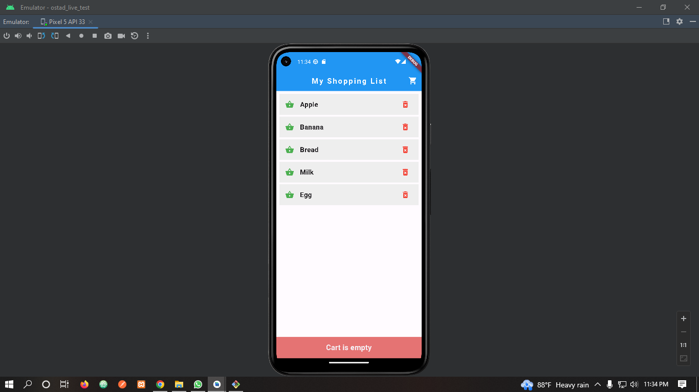

The page should have a Scaffold as the root widget.

1. Inside the Scaffold, create an AppBar with the title "My Shopping List". 
2. Below the AppBar, create a ListView widget to display the list of shopping items. 
3. Each item in the list should be represented by a ListTile widget.
4. Each ListTile should display an icon on the left, followed by the name of the shopping item. 
5. The list should have at least 5 shopping items. 
6. Add appropriate padding, spacing, and styling to make the app visually appealing. 
7. Use the IconButton widget to add an icon button on the AppBar. When pressed, it should display a Snackbar with the message "Cart is empty".

8. Github repo link

# The .readme file in github must contain screenshots of the whole app

